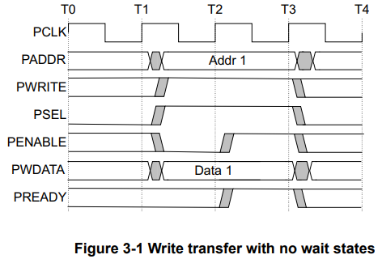

1.  AMBA APB spec (SystemVerilog Assertion, SVA)
    a.
    

        a.1. PSEL 為 HIGH 時，
              1. PADDR 不可為 X 值
                SVA Code:
                    property p_psel_high_p_paddr_no_x;
                        @(posedge clk) psel |-> !isunknown(paddr);
                    endproperty
                    assert property(p_psel_high_p_paddr_no_x) else `uvm_error("ASSERT", PADDR is UNKNOW when PSEL HIGH)

        a.2. PSEL 為 HIGH 時，
              1. PENABLE 也必須為 HIGH
                SVA Code:
                    property p_psel_rose_next_cycle_p_penable_rise;
                        @(posedge clk) $rose(psel) |-> $rose(penable);
                    endproperty
                    assert property(p_psel_rose_next_cycle_p_penable_rise) else `uvm_error("ASSERT", PENABLE not rose after 1 cycle PSEL rose)
